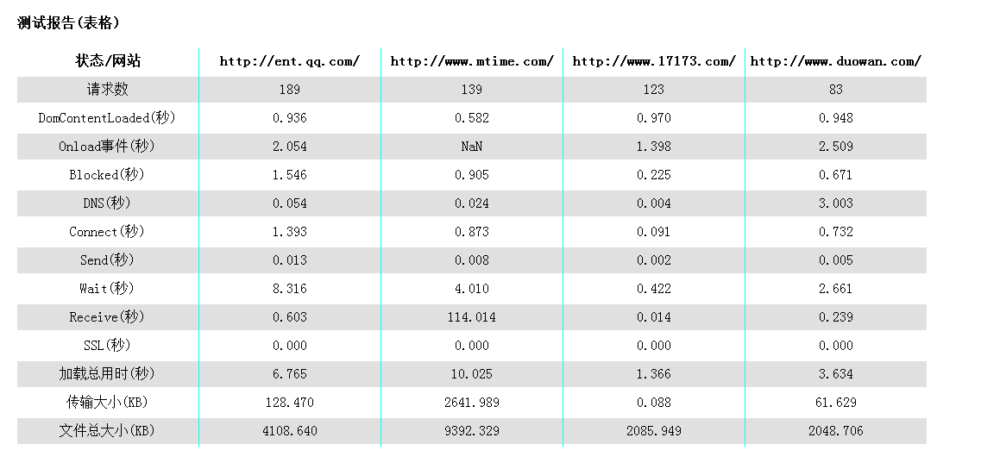
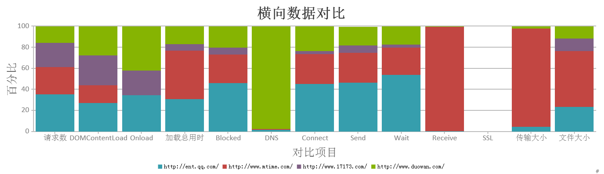

PowerDevTools
=============

增强chrome的developer tool

###说明

1. 加载总用时为页面加载完,停留稳定后的总用时,包括延迟加载的内容(一般为第一屏的图片,如果图片做了延迟加载的话)

###备忘

1. 页面的请求大小和加载时间
2. 所有请求各阶段(blocked,dns lookup,wait等)的比例
3. 文件类型比例
4. 请求的数量

###截图

####禁用缓存

####带缓存

